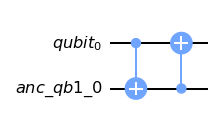

# Introduction
Here a solution for the Task 2 of the QOSF Mentorship program in February 2021 is presented.

The task requested, as first step, to prepare the circuit for the Bell state (|00> + |11>) / sqrt(2) and to add per each 
qubit an error (identity, phase flip or bit flip) before the cnot gate with some probability.
Therefore, obtaining in the following circuit


The task then asked to encode each qubit with an error correction code, so that all the possible 1-qubit error 
configurations can be detected and corrected.

# Solution
The solution is implemented in Qiskit and consists of two main components, in addition to the entry point ```main.py```:

- ```bell_circuit.py``` contains the circuit class that implements all the error corrections method that will be 
  discussed;
  
- ```simulations.py``` contains methods to run different kinds of simulations in order to validate the error correction 
  methods and related assumptions.
  
## Usage
First of all, one must install the requirements via ```pip install -r requirements.txt```.

Once requirements are installed, the code can be run via CLI as
```
usage: main.py [-h] [--print-circuit] [--try-all] [-i ITERATIONS] [-p PROBABILITIES PROBABILITIES PROBABILITIES] [-s SEED]
               [-e ERROR ERROR ERROR ERROR] [-o OUTPUT]
               {no_correction,simple,repetition_simple,shor}

Bell state circuit with error correction simulation.

positional arguments:
  {no_correction,simple,repetition_simple,shor}
                        The type of correction to use

optional arguments:
  -h, --help            show this help message and exit
  --print-circuit       Plot circuit with symbolic errors. If present all the simulation arguments will be ignored and it
                        will only plot the circuit.
  --try-all             Try all the possible 1-qubit error combinations. It is assumed that for 1 qubit and its ancillas only
                        1 error can happen in either the qubit or one of the ancillas. If this argument is not provided then
                        a random error set up will be generated.
  -i ITERATIONS, --iterations ITERATIONS
                        The number of iterations to simulate the circuit generating a random set of errors each time. The
                        argument will be ignored if --try-all or --error are present. Default: 1
  -p PROBABILITIES PROBABILITIES PROBABILITIES, --probabilities PROBABILITIES PROBABILITIES PROBABILITIES
                        Probabilities, more correctly weights, for each error gate. Pass as <p_i> <p_x> <p_z>.If not passed,
                        probability is equally distributed.The argument will be ignored if --error is present
  -s SEED, --seed SEED  Seed to generate random error set.
  -e ERROR ERROR ERROR ERROR, --error ERROR ERROR ERROR ERROR
                        Specific error to be simulated in the format <qubit_1> <gate_1> <qubit_2> <gate_2> where qubit_1 and
                        qubit_2 are the qubits, in each correction group respectively, to which apply the error and can range
                        from 0 to n_ancillas, while gate_1 and gate_2 are the error gates (ex: 0 x 1 z). The argument will be
                        ignored if --try-all is present.
  -o OUTPUT, --output OUTPUT
                        File path to store output.
```
  
## Outline
Three possible error correction methods will be presented, starting from the most specific one and removing each time some 
assumptions to move into a more general circuit.

## Measurement
Before diving into the error correction methods, we need to identify a procedure to verify the results. To this purpose, 
at the end of the bell state circuit it will be added the following operations


We know, also from the superdense coding theory, that if the qubits will be in the desired Bell state then we will get 
|00> after the above operation, while we will get |10>, |01> |11> for states where the error was not properly corrected,
i.e. the other three Bell states.

## No correction
In the case in which we perform no correction, then we can expect to measure all the four possible Bell state. 
To visualize the circuit one can run ```python main.py no_correction --print-circuit```


To verify the expected result with the provided solution, let's run ```python main.py no_correection --try-all```


As we can notice, the states do not have equal probability. This will become more clear when we will analyze the impact
of the errors on the qubits and we will see how some errors still lead to the correct state.


## First method: Simple correction with one ancilla per qubit
As per task description, we have the following assumptions when the error can happen:

- the Qubit 0 is in the state |x>
- the Qubit 1 is in the state |0>
- the ancillas are in the state |0>
- the error can happen only to the Bell state qubits and not to the auxiliary ancillas

Under these assumptions, we can correct any possible error with one ancilla per qubit. To understand how, it is easier 
to analyze qubit by qubit all the possible cases.

### Qubit 0
#### Bit flip
The bit flip error is implemented applying the X gate to the qubit. For qubit 0 that is in an eigenstate of X 
with eigenvalue 1 (X|x> = |x>) this operation has no impact. Therefore, if a bit flip happens to the qubit 0 there 
is no need to correct it.

#### Phase flip
The phase flip is implemented applying the Z gate to the qubit. In this case the state of the qubit 0 will change into 
(|0> - |1>) / sqrt(2). With the support of an ancilla qubit, we can detect and correct the error with the following 
circuit


### Qubit 1
#### Bit flip
For qubit 1 that is in the state |0>, the bit flip will return the state |1>. Similarly to the above case for phase 
flip, we can detect and correct this error with the following circuit



One must note, that in case of error the ancilla will then remain in the state |1>, but we are only interested to have 
the qubit 1 in the correct state |0>.

#### Phase flip
The state |0> is eigenstate of Z with eigenvalue 1, so in this case it won't be necessary to correct any error for the
qubit 1.

### Circuit and simulation
The full circuit will then be ```python main.py simple --print-circuit```


and running all the possible error setup with ```python main.py simple --try-all``` we get


Having 3 possible errors (i, x, z) and 2 qubits, there are 9 possible setup for the errors (ii, ix, iz, xi, xx, xz, zi, 
zx, zz). We run the circuit with 1000 shots, so we have a total of 9000 measurements, all in the |00> state, 
confirming that, under our assumptions, this method is correct.

## Second method: Correction with repetition and two ancillas per qubit
We now generalize more with the following assumptions:

- the Qubit 0 is in the state |x>
- the Qubit 1 is in the state |0>
- the ancillas are in the state |0>
- the error can happen also in the ancillas, but we limit to one error per logic qubit (i.e. qubit + ancillas)

Like in the previous method, we will analyze qubit by qubit and, since we didn't change assumptions on the initial 
states, we can skip error cases that we know have no effect.

### Qubit 0
We know that for this qubit the only problematic error is the phase flip one. But this time the error can happen also 
in the ancillas, being in the state |0>. Therefore, the errors that we need to correct are: phase flip in the qubit and 
bit flip in the ancillas. Since we assumed that only one error can happen, we need two ancillas and the following 
circuit


In fact, the only possible states after the error are |x00>, |-x00>, |x10>, |x01> and the above circuit ensures that the 
qubit 0 will always be |x>.

### Qubit 1
For qubit 1 the phase flip has no effect, so we have to consider only the bit flip error for the qubit and the ancillas.
Similarly to qubit 0, the only possible states after the error are |000>, |100>, |010> and |001>. Hence, we can correct 
any error on the qubit 1 with the following circuit


### Circuit and simulation
The full circuit will then be ```python main.py repetition_simple --print-circuit```


and running all the possible error setup with ```python main.py repetition_simple --try-all --output out``` we get

```Total counts: {'00': 81000}```

since there are 81 ways to set up the three errors in the two logic qubits.

## Third method: Shor correction code
We now remove assumptions on the initial states of the two qubits and keep the following assumptions:

- the ancillas are in the state |0>
- the error can happen also in the ancillas, but we limit to one error per logic qubit (i.e. qubit + ancillas)

Since the qubits can now be in a more general initial state all the errors, the phase flip and the bit flip, can impact 
both of them.

In this case, one can encode each qubit with the 
[Shor code](https://en.wikipedia.org/wiki/Quantum_error_correction#The_Shor_code), using 8 ancillas.

In this case each qubit and ancillas will be shielded by any 1-qubit error (i, z, x and a combination of them).

### Simulation
Running all the possible error setup with ```python main.py shor --try-all --output out``` we get

```Total counts: {'00': 729000}```

since there are 729 ways to set up the three errors in the two logic qubits.

## Multiple errors per logical qubit
In all the three proposed methods we have always assumed that per each logic qubit (qubit + ancillas) only one error could 
happen. Overall, to correct multiple errors one could use more repetitions qubit and use a lookup table to decode, as 
demonstrated in the 
[qiskit textbook](https://qiskit.org/textbook/ch-quantum-hardware/error-correction-repetition-code.html#Quantum-repetition-code). 
In fact the more repetitions are used the more likely is for the logic qubit to 
have the correct value. 

To better understand this, let's consider the case of 1 qubit and 2 ancillas. If **p** is the probability of flipping one qubit, 
then the probability to flip more than one is **p^{3} + 3(1-p)p^{2}**. If **p** is small enough or there are more 
repetition, that lead to higher powers of **p**, then it is very unlikely to have multiple flips.

# Conclusion
We have presented three different error correction methods, going from the less general to the most general one, 
under the assumption that only 1-qubit error can happen per logic qubit.

Given the specific problem of the task one could use the second method without loss of generality with 
respect the Shor code. In fact, the only difference between the two set of assumptions is the initial state of the 
qubits.

Moreover, the code allowed us to test all the possible error setup, but one can also try a specific error setup with the 
flag ```--error <qubit_1> <gate_1> <qubit_2> <gate_2>```.

Finally, it is also possible to run random error setup with the command ```python main.py <correction_method> 
--iterations 1000``` and also add different probabilities with ```--probabilities <p_i> <p_x> <p_z>```
